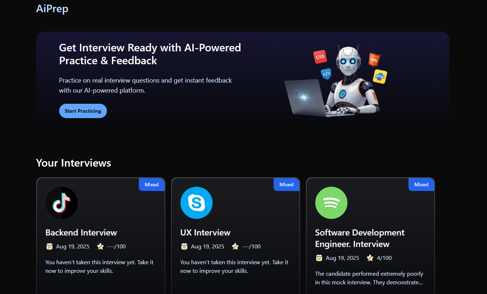

# aiprep



**aiprep** is a platform designed to help users prepare for AI-related interviews, exams, and certifications. It provides curated resources, practice questions, and study guides covering essential AI concepts, programming, and problem-solving techniques. Whether you're a beginner or an experienced professional, aiprep aims to support your learning journey and boost your confidence in AI topics.

## Features

- Curated AI interview questions and answers
- Study guides for key AI concepts and technologies
- Practice coding problems and solutions
- User authentication (sign up/sign in)
- Personalized interview preparation dashboard
- AI-powered feedback and scoring using Google Gemini (via `@ai-sdk/google`)
- Feedback and progress tracking

## Tech Stack

- **Next.js** (App Router)
- **TypeScript**
- **Firebase** (Authentication & Admin)
- **Tailwind CSS** (for styling)
- **Vercel AI SDK** and **Google Gemini SDK** (`@ai-sdk/google`)
- **ESLint** (for code quality)

## Project Structure

```
components/         # Reusable React components (UI, forms, interview cards, etc.)
constants/          # Constant values and schemas
firebase/           # Firebase client and admin setup
lib/                # Utility functions, API integrations, and AI actions
public/             # Static assets (images, icons, company covers, etc.)
types/              # TypeScript type definitions
app/                # Next.js app directory (routes, layouts, API endpoints)
  (auth)/           # Authentication pages (sign-in, sign-up)
  (root)/           # Main app pages (dashboard, interview, feedback)
  api/              # API routes (including AI-powered endpoints)
```

## AI Integration

- Uses the [Google Gemini model](https://ai.google.dev/gemini-api/docs) via the `@ai-sdk/google` package for:
  - Generating interview questions tailored to role, level, and tech stack
  - Providing structured, AI-powered feedback and scoring for mock interviews

## Getting Started

1. **Clone the repository:**

   ```powershell
   git clone https://github.com/raorohit22/aiprep.git
   cd aiprep
   ```

2. **Install dependencies:**

   ```powershell
   npm install
   ```

3. **Set up environment variables:**

   - Create a `.env.local` file in the root directory.
   - Add your Firebase and any required API keys (e.g., for Google Gemini).

4. **Run the development server:**

   ```powershell
   npm run dev
   ```

5. **Open [http://localhost:3000](http://localhost:3000) in your browser.**

## Contributing

Contributions are welcome! Please open issues or submit pull requests for improvements and bug fixes.

## License

This project is licensed under the MIT License.

---

\*Empowering your AI interview journey with the right
